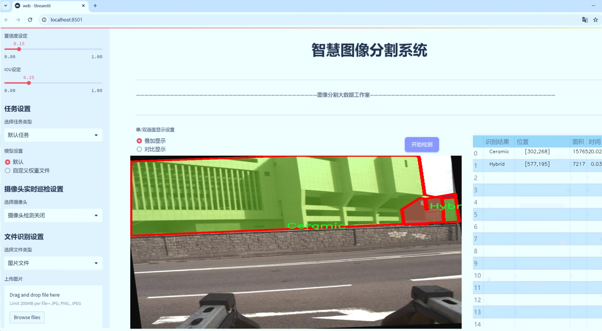
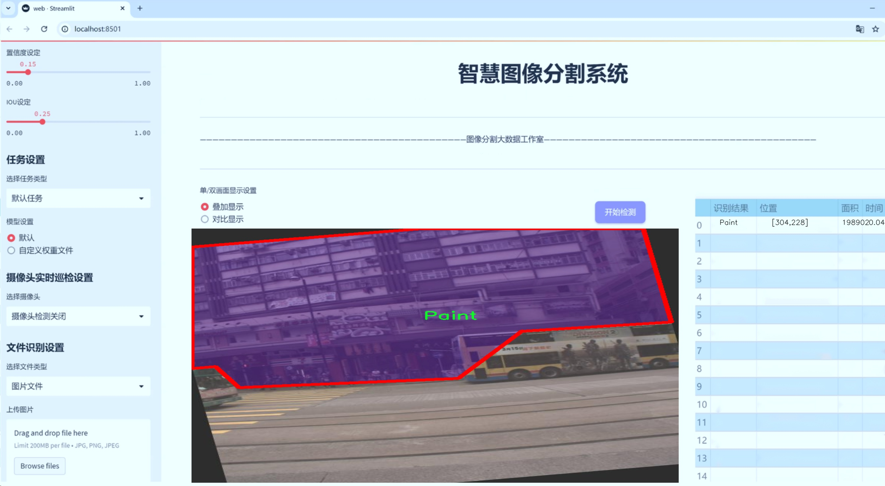
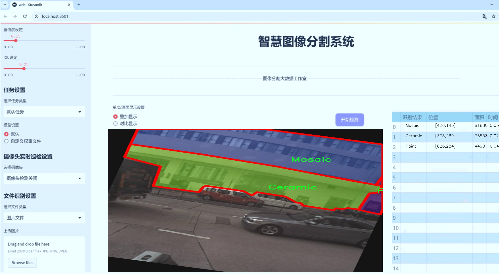
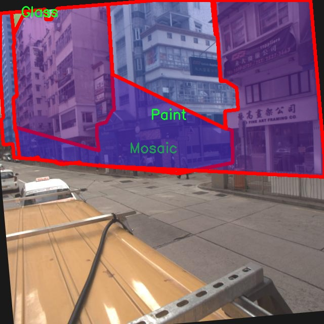
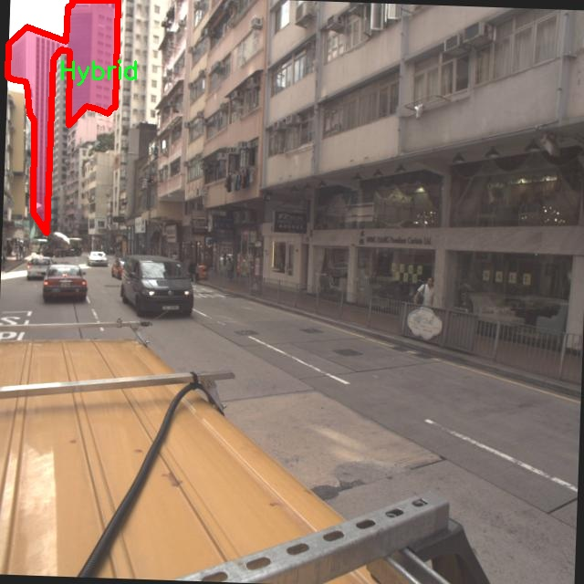
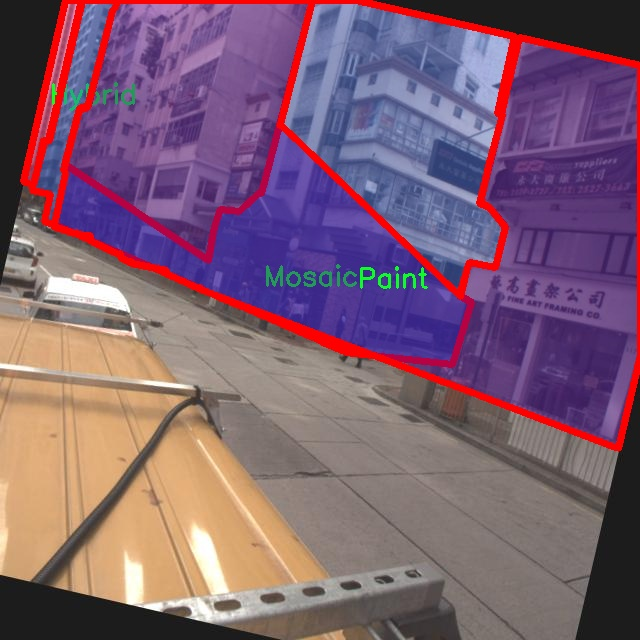
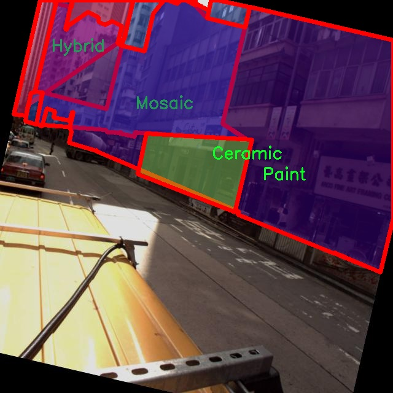
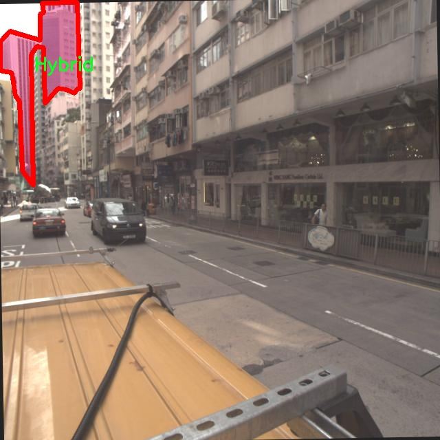

# 建筑外立面材料识别图像分割系统： yolov8-seg-C2f-Parc

### 1.研究背景与意义

[参考博客](https://gitee.com/YOLOv8_YOLOv11_Segmentation_Studio/projects)

[博客来源](https://kdocs.cn/l/cszuIiCKVNis)

研究背景与意义

随着城市化进程的加快，建筑外立面的设计与材料选择在城市景观和建筑美学中扮演着越来越重要的角色。建筑外立面不仅是建筑物的“面子”，更是反映城市文化、历史和技术进步的重要载体。因此，准确识别和分析建筑外立面材料，对于提升建筑设计质量、优化城市环境以及推动可持续发展具有重要意义。近年来，计算机视觉技术的迅猛发展为建筑外立面材料的自动识别提供了新的机遇，尤其是深度学习技术的应用，使得图像分割和物体识别的精度和效率得到了显著提升。

在众多深度学习模型中，YOLO（You Only Look Once）系列因其高效的实时目标检测能力而受到广泛关注。YOLOv8作为该系列的最新版本，进一步优化了模型结构和算法性能，具备了更强的特征提取和分类能力。然而，针对建筑外立面材料的特定应用场景，YOLOv8仍存在一定的局限性。为了提升建筑外立面材料的识别精度和分割效果，本文提出了一种基于改进YOLOv8的建筑外立面材料识别图像分割系统。

本研究所使用的数据集包含1600张建筑外立面材料的图像，涵盖了陶瓷、玻璃、混合材料、金属、马赛克和涂料等六大类。这些材料在建筑外立面中具有广泛的应用，各自的视觉特征和物理属性差异显著，给图像分割和识别带来了挑战。通过对这些材料进行深入分析和研究，不仅可以提高模型对不同材料的识别能力，还能够为建筑设计师和工程师提供更为精准的材料选择依据。

本研究的意义在于，首先，通过改进YOLOv8模型，能够实现对建筑外立面材料的高效、准确的识别与分割，推动建筑领域的智能化发展。其次，基于图像分割的建筑外立面材料识别系统，可以为城市规划、建筑设计、材料选择等提供数据支持，促进建筑行业的可持续发展。此外，研究成果将为相关领域的学术研究提供参考，推动计算机视觉技术在建筑材料识别中的应用与发展。

综上所述，基于改进YOLOv8的建筑外立面材料识别图像分割系统，不仅具有重要的理论研究价值，也具备广泛的实际应用前景。通过对建筑外立面材料的精准识别与分析，将为提升建筑设计质量、优化城市环境、推动可持续发展提供强有力的技术支持。

### 2.图片演示







注意：本项目提供完整的训练源码数据集和训练教程,由于此博客编辑较早,暂不提供权重文件（best.pt）,需要按照6.训练教程进行训练后实现上图效果。

### 3.视频演示

[3.1 视频演示](https://www.bilibili.com/video/BV195zGYbEAf/)

### 4.数据集信息

##### 4.1 数据集类别数＆类别名

nc: 6
names: ['Ceramic', 'Glass', 'Hybrid', 'Metal', 'Mosaic', 'Paint']


##### 4.2 数据集信息简介

数据集信息展示

在现代建筑设计与施工中，外立面的材料选择不仅影响建筑的美观性，还对其功能性和耐久性起着至关重要的作用。因此，开发一个高效的建筑外立面材料识别系统显得尤为重要。本研究旨在改进YOLOv8-seg模型，以实现对建筑外立面材料的精准图像分割与识别。为此，我们构建了一个名为“Facade materials without background”的数据集，专门用于训练和验证该系统的性能。

该数据集包含六种不同的建筑外立面材料类别，分别为陶瓷（Ceramic）、玻璃（Glass）、混合材料（Hybrid）、金属（Metal）、马赛克（Mosaic）和涂料（Paint）。这些类别不仅涵盖了现代建筑中常见的外立面材料，还考虑到了不同材料在视觉和功能上的多样性。每一种材料都具有独特的纹理、色彩和反射特性，这为模型的训练提供了丰富的样本和挑战。

在数据集的构建过程中，我们特别关注了图像的质量和多样性。每种材料类别均包含大量高分辨率的图像，这些图像是在不同的光照条件和角度下拍摄的，以确保模型能够在各种实际应用场景中表现出色。此外，为了消除背景对模型训练的干扰，我们采用了无背景的图像，使得模型能够更专注于材料本身的特征提取。这种设计不仅提高了模型的学习效率，还增强了其在复杂环境下的识别能力。

数据集的标注工作同样至关重要。我们采用了专业的图像标注工具，对每张图像进行了精确的分割和标注，确保每种材料的边界清晰可辨。这一过程不仅提高了数据集的准确性，也为后续的模型训练提供了可靠的基础。通过精细的标注，我们能够确保模型在识别不同材料时，能够有效地分离和识别出每种材料的特征，从而实现高效的图像分割。

在训练过程中，我们将“Facade materials without background”数据集与改进的YOLOv8-seg模型相结合，旨在提升模型在建筑外立面材料识别中的准确性和鲁棒性。通过对比实验，我们将评估模型在不同材料类别上的表现，分析其在图像分割任务中的优缺点。预计该数据集将为研究人员和工程师提供一个强有力的工具，帮助他们在建筑材料识别领域取得更大的进展。

总之，“Facade materials without background”数据集不仅为建筑外立面材料的识别提供了丰富的样本和准确的标注，还为改进YOLOv8-seg模型的训练奠定了坚实的基础。随着建筑行业对材料识别技术需求的不断增加，该数据集的应用前景广阔，有望推动相关领域的研究与发展。











### 5.项目依赖环境部署教程（零基础手把手教学）

[5.1 环境部署教程链接（零基础手把手教学）](https://www.bilibili.com/video/BV1jG4Ve4E9t/?vd_source=bc9aec86d164b67a7004b996143742dc)


[5.2 安装Python虚拟环境创建和依赖库安装视频教程链接（零基础手把手教学）](https://www.bilibili.com/video/BV1nA4VeYEze/?vd_source=bc9aec86d164b67a7004b996143742dc)

### 6.手把手YOLOV8-seg训练视频教程（零基础手把手教学）

[6.1 手把手YOLOV8-seg训练视频教程（零基础小白有手就能学会）](https://www.bilibili.com/video/BV1cA4VeYETe/?vd_source=bc9aec86d164b67a7004b996143742dc)


按照上面的训练视频教程链接加载项目提供的数据集，运行train.py即可开始训练



     Epoch   gpu_mem       box       obj       cls    labels  img_size
     1/200     0G   0.01576   0.01955  0.007536        22      1280: 100%|██████████| 849/849 [14:42<00:00,  1.04s/it]
               Class     Images     Labels          P          R     mAP@.5 mAP@.5:.95: 100%|██████████| 213/213 [01:14<00:00,  2.87it/s]
                 all       3395      17314      0.994      0.957      0.0957      0.0843

     Epoch   gpu_mem       box       obj       cls    labels  img_size
     2/200     0G   0.01578   0.01923  0.007006        22      1280: 100%|██████████| 849/849 [14:44<00:00,  1.04s/it]
               Class     Images     Labels          P          R     mAP@.5 mAP@.5:.95: 100%|██████████| 213/213 [01:12<00:00,  2.95it/s]
                 all       3395      17314      0.996      0.956      0.0957      0.0845

     Epoch   gpu_mem       box       obj       cls    labels  img_size
     3/200     0G   0.01561    0.0191  0.006895        27      1280: 100%|██████████| 849/849 [10:56<00:00,  1.29it/s]
               Class     Images     Labels          P          R     mAP@.5 mAP@.5:.95: 100%|███████   | 187/213 [00:52<00:00,  4.04it/s]
                 all       3395      17314      0.996      0.957      0.0957      0.0845


### 7.50+种全套YOLOV8-seg创新点加载调参实验视频教程（一键加载写好的改进模型的配置文件）

[7.1 50+种全套YOLOV8-seg创新点加载调参实验视频教程（一键加载写好的改进模型的配置文件）](https://www.bilibili.com/video/BV1Hw4VePEXv/?vd_source=bc9aec86d164b67a7004b996143742dc)

### YOLOV8-seg算法简介

原始YOLOV8-seg算法原理

YOLO（You Only Look Once）系列算法自2015年首次提出以来，已经经历了多个版本的迭代与更新，YOLOv8作为最新的版本，展现了在目标检测与分割任务中的显著进步。YOLOv8-seg算法不仅继承了YOLO系列的高效性与实时性，还在网络结构与损失计算等方面进行了多项创新，使其在精度与速度上都达到了新的高度。

YOLOv8的设计理念是将复杂的目标检测任务简化为一个单一的回归问题，通过直接预测边界框和类别概率，极大地提高了检测速度。在YOLOv8-seg中，模型的结构分为输入端、主干网络、颈部网络和头部网络四个主要部分。输入端负责数据的预处理，包括马赛克数据增强、自适应锚框计算和自适应灰度填充等技术，这些技术不仅增强了模型的鲁棒性，还提升了其对多样化场景的适应能力。

主干网络是YOLOv8-seg的核心，采用了新的C2f模块，这一模块在YOLOv5的C3模块基础上进行了改进，结合了YOLOv7中的ELAN结构，增加了更多的残差连接。这种设计使得模型在保持轻量化的同时，能够获得更丰富的梯度信息，从而提高特征提取的能力。C2f模块通过跨层连接的方式，促进了特征的多样性和丰富性，进而提升了模型对复杂场景的理解能力。

颈部网络采用了路径聚合网络（PAN）结构，这一结构的设计旨在加强不同尺度对象的特征融合能力。通过有效地整合来自不同层次的特征，PAN能够提升模型对小目标和大目标的检测精度，使得YOLOv8-seg在处理各种尺寸的目标时表现得更加出色。颈部网络的设计不仅提高了特征的表达能力，还增强了模型对多尺度目标的适应性。

在头部网络中，YOLOv8-seg采用了解耦合头结构，将分类和检测过程分开处理。这一创新使得模型在处理目标检测时，能够更加灵活地应对不同的任务需求。通过将Anchor-Based方法替换为Anchor-Free策略，YOLOv8-seg减少了锚框的预测数量，从而加速了非最大抑制（NMS）过程，提高了检测效率。这种解耦合的设计使得模型在面对复杂场景时，能够更好地进行目标分类与定位。

在损失计算方面，YOLOv8-seg采用了多种损失函数的组合，以提高模型的训练效果。分类损失使用了二元交叉熵损失（BCELoss），而回归损失则结合了分布焦点损失（DFLoss）和完全交并比损失（CIOULoss）。这种损失函数的设计不仅提升了模型对边界框预测的精准性，还增强了模型在不同任务中的适应能力。

YOLOv8-seg在训练过程中引入了动态Task-Aligned Assigner样本分配策略，能够根据分类与回归的分数加权结果选择正样本。这一策略的引入使得模型在训练时能够更加有效地利用样本，提高了训练的效率和效果。同时，YOLOv8-seg在数据增强方面也进行了创新，特别是在最后10个epoch中关闭马赛克增强，确保模型在训练后期能够更好地适应真实场景。

综上所述，YOLOv8-seg算法通过对网络结构的优化、损失计算的改进以及训练策略的创新，展现了在目标检测与分割任务中的强大能力。其高效的特征提取与融合能力，使得YOLOv8-seg在实时性与精度上都取得了显著的进步，成为了当前目标检测领域中一个具有广泛应用前景的算法。随着YOLOv8-seg的不断发展与完善，未来在智能监控、自动驾驶、医疗影像等领域的应用将更加广泛，推动相关技术的进步与创新。


### 9.系统功能展示（检测对象为举例，实际内容以本项目数据集为准）

图9.1.系统支持检测结果表格显示

  图9.2.系统支持置信度和IOU阈值手动调节

  图9.3.系统支持自定义加载权重文件best.pt(需要你通过步骤5中训练获得)

  图9.4.系统支持摄像头实时识别

  图9.5.系统支持图片识别

  图9.6.系统支持视频识别

  图9.7.系统支持识别结果文件自动保存

  图9.8.系统支持Excel导出检测结果数据


### 10.50+种全套YOLOV8-seg创新点原理讲解（非科班也可以轻松写刊发刊，V11版本正在科研待更新）

#### 10.1 由于篇幅限制，每个创新点的具体原理讲解就不一一展开，具体见下列网址中的创新点对应子项目的技术原理博客网址【Blog】：


[10.1 50+种全套YOLOV8-seg创新点原理讲解链接](https://gitee.com/qunmasj/good)

#### 10.2 部分改进模块原理讲解(完整的改进原理见上图和技术博客链接)【如果此小节的图加载失败可以通过CSDN或者Github搜索该博客的标题访问原始博客，原始博客图片显示正常】

### YOLOv8简介
#### Backbone
Darknet-53
53指的是“52层卷积”+output layer。

借鉴了其他算法的这些设计思想

借鉴了VGG的思想，使用了较多的3×3卷积，在每一次池化操作后，将通道数翻倍；

借鉴了network in network的思想，使用全局平均池化（global average pooling）做预测，并把1×1的卷积核置于3×3的卷积核之间，用来压缩特征；（我没找到这一步体现在哪里）


使用了批归一化层稳定模型训练，加速收敛，并且起到正则化作用。

    以上三点为Darknet19借鉴其他模型的点。Darknet53当然是在继承了Darknet19的这些优点的基础上再新增了下面这些优点的。因此列在了这里

借鉴了ResNet的思想，在网络中大量使用了残差连接，因此网络结构可以设计的很深，并且缓解了训练中梯度消失的问题，使得模型更容易收敛。

使用步长为2的卷积层代替池化层实现降采样。（这一点在经典的Darknet-53上是很明显的，output的长和宽从256降到128，再降低到64，一路降低到8，应该是通过步长为2的卷积层实现的；在YOLOv8的卷积层中也有体现，比如图中我标出的这些位置）

#### 特征融合

模型架构图如下

  Darknet-53的特点可以这样概括：（Conv卷积模块+Residual Block残差块）串行叠加4次

  Conv卷积层+Residual Block残差网络就被称为一个stage


上面红色指出的那个，原始的Darknet-53里面有一层 卷积，在YOLOv8里面，把一层卷积移除了

为什么移除呢？

        原始Darknet-53模型中间加的这个卷积层做了什么？滤波器（卷积核）的个数从 上一个卷积层的512个，先增加到1024个卷积核，然后下一层卷积的卷积核的个数又降低到512个

        移除掉这一层以后，少了1024个卷积核，就可以少做1024次卷积运算，同时也少了1024个3×3的卷积核的参数，也就是少了9×1024个参数需要拟合。这样可以大大减少了模型的参数，（相当于做了轻量化吧）

        移除掉这个卷积层，可能是因为作者发现移除掉这个卷积层以后，模型的score有所提升，所以才移除掉的。为什么移除掉以后，分数有所提高呢？可能是因为多了这些参数就容易，参数过多导致模型在训练集删过拟合，但是在测试集上表现很差，最终模型的分数比较低。你移除掉这个卷积层以后，参数减少了，过拟合现象不那么严重了，泛化能力增强了。当然这个是，拿着你做实验的结论，反过来再找补，再去强行解释这种现象的合理性。


通过MMdetection官方绘制册这个图我们可以看到，进来的这张图片经过一个“Feature Pyramid Network(简称FPN)”，然后最后的P3、P4、P5传递给下一层的Neck和Head去做识别任务。 PAN（Path Aggregation Network）


“FPN是自顶向下，将高层的强语义特征传递下来。PAN就是在FPN的后面添加一个自底向上的金字塔，对FPN补充，将低层的强定位特征传递上去，

FPN是自顶（小尺寸，卷积次数多得到的结果，语义信息丰富）向下（大尺寸，卷积次数少得到的结果），将高层的强语义特征传递下来，对整个金字塔进行增强，不过只增强了语义信息，对定位信息没有传递。PAN就是针对这一点，在FPN的后面添加一个自底（卷积次数少，大尺寸）向上（卷积次数多，小尺寸，语义信息丰富）的金字塔，对FPN补充，将低层的强定位特征传递上去，又被称之为“双塔战术”。

FPN层自顶向下传达强语义特征，而特征金字塔则自底向上传达强定位特征，两两联手，从不同的主干层对不同的检测层进行参数聚合,这样的操作确实很皮。
#### 自底向上增强


而 PAN（Path Aggregation Network）是对 FPN 的一种改进，它的设计理念是在 FPN 后面添加一个自底向上的金字塔。PAN 引入了路径聚合的方式，通过将浅层特征图（低分辨率但语义信息较弱）和深层特征图（高分辨率但语义信息丰富）进行聚合，并沿着特定的路径传递特征信息，将低层的强定位特征传递上去。这样的操作能够进一步增强多尺度特征的表达能力，使得 PAN 在目标检测任务中表现更加优秀。


### Gold-YOLO简介
YOLO系列模型面世至今已有8年，由于其优异的性能，已成为目标检测领域的标杆。在系列模型经过十多个不同版本的改进发展逐渐稳定完善的今天，研究人员更多关注于单个计算模块内结构的精细调整，或是head部分和训练方法上的改进。但这并不意味着现有模式已是最优解。

当前YOLO系列模型通常采用类FPN方法进行信息融合，而这一结构在融合跨层信息时存在信息损失的问题。针对这一问题，我们提出了全新的信息聚集-分发（Gather-and-Distribute Mechanism）GD机制，通过在全局视野上对不同层级的特征进行统一的聚集融合并分发注入到不同层级中，构建更加充分高效的信息交互融合机制，并基于GD机制构建了Gold-YOLO。在COCO数据集中，我们的Gold-YOLO超越了现有的YOLO系列，实现了精度-速度曲线上的SOTA。


精度和速度曲线（TensorRT7）


精度和速度曲线（TensorRT8）
传统YOLO的问题
在检测模型中，通常先经过backbone提取得到一系列不同层级的特征，FPN利用了backbone的这一特点，构建了相应的融合结构：不层级的特征包含着不同大小物体的位置信息，虽然这些特征包含的信息不同，但这些特征在相互融合后能够互相弥补彼此缺失的信息，增强每一层级信息的丰富程度，提升网络性能。

原始的FPN结构由于其层层递进的信息融合模式，使得相邻层的信息能够充分融合，但也导致了跨层信息融合存在问题：当跨层的信息进行交互融合时，由于没有直连的交互通路，只能依靠中间层充当“中介”进行融合，导致了一定的信息损失。之前的许多工作中都关注到了这一问题，而解决方案通常是通过添加shortcut增加更多的路径，以增强信息流动。

然而传统的FPN结构即便改进后，由于网络中路径过多，且交互方式不直接，基于FPN思想的信息融合结构仍然存在跨层信息交互困难和信息损失的问题。

#### Gold-YOLO：全新的信息融合交互机制


#### Gold-YOLO架构
参考该博客提出的一种全新的信息交互融合机制：信息聚集-分发机制(Gather-and-Distribute Mechanism)。该机制通过在全局上融合不同层次的特征得到全局信息，并将全局信息注入到不同层级的特征中，实现了高效的信息交互和融合。在不显著增加延迟的情况下GD机制显著增强了Neck部分的信息融合能力，提高了模型对不同大小物体的检测能力。

GD机制通过三个模块实现：信息对齐模块(FAM)、信息融合模块(IFM)和信息注入模块(Inject)。

信息对齐模块负责收集并对齐不同层级不同大小的特征

信息融合模块通过使用卷积或Transformer算子对对齐后的的特征进行融合，得到全局信息

信息注入模块将全局信息注入到不同层级中

在Gold-YOLO中，针对模型需要检测不同大小的物体的需要，并权衡精度和速度，我们构建了两个GD分支对信息进行融合：低层级信息聚集-分发分支(Low-GD)和高层级信息聚集-分发分支(High-GD)，分别基于卷积和transformer提取和融合特征信息。

此外,为了促进局部信息的流动，我们借鉴现有工作，构建了一个轻量级的邻接层融合模块，该模块在局部尺度上结合了邻近层的特征，进一步提升了模型性能。我们还引入并验证了预训练方法对YOLO模型的有效性，通过在ImageNet 1K上使用MAE方法对主干进行预训练，显著提高了模型的收敛速度和精度。


### 11.项目核心源码讲解（再也不用担心看不懂代码逻辑）

#### 11.1 ultralytics\models\yolo\__init__.py

下面是对给定代码的逐行分析和核心部分的保留，同时添加了详细的中文注释：

```python
# 引入Ultralytics YOLO库，遵循AGPL-3.0许可证

# 从ultralytics.models.yolo模块中导入四个功能函数：分类(classify)、检测(detect)、姿态估计(pose)和分割(segment)
from ultralytics.models.yolo import classify, detect, pose, segment

# 从当前模块中导入YOLO模型类
from .model import YOLO

# 定义模块的公开接口，包含四个功能函数和YOLO模型类
__all__ = 'classify', 'segment', 'detect', 'pose', 'YOLO'
```

### 核心部分分析：
1. **导入功能函数**：这部分代码导入了YOLO模型的四个主要功能，分别用于图像分类、目标检测、姿态估计和图像分割。这些功能是YOLO模型的核心应用，能够处理不同类型的计算机视觉任务。

2. **导入YOLO模型类**：通过导入YOLO类，可以在其他模块中实例化和使用YOLO模型，进行训练或推理。

3. **模块公开接口**：`__all__`变量定义了当使用`from module import *`时，哪些名称会被导入。这是一个良好的编程习惯，有助于明确模块的公共API。

### 结论：
这段代码的核心在于导入YOLO模型的主要功能和定义模块的公共接口，为后续的计算机视觉任务提供了基础。

这个文件是Ultralytics YOLO模型的初始化文件，通常用于定义模块的公共接口。在文件的开头，有一个注释，表明这是Ultralytics YOLO项目的一部分，并且它遵循AGPL-3.0许可证。

接下来，文件从`ultralytics.models.yolo`模块中导入了四个功能：`classify`、`detect`、`pose`和`segment`。这些功能分别对应于YOLO模型的不同应用场景，具体来说，`classify`用于分类任务，`detect`用于目标检测，`pose`用于姿态估计，而`segment`则用于图像分割。

此外，文件还从当前目录下的`model`模块中导入了`YOLO`类。这个类可能是YOLO模型的核心实现，负责模型的构建和推理。

最后，`__all__`变量被定义为一个元组，包含了前面导入的所有功能和类。这意味着当使用`from ultralytics.models.yolo import *`这样的语句时，只会导入`classify`、`segment`、`detect`、`pose`和`YOLO`，而不会导入其他未列出的内容。这种做法有助于控制模块的公共接口，避免不必要的命名冲突和提高代码的可读性。

#### 11.2 ultralytics\nn\extra_modules\ops_dcnv3\functions\dcnv3_func.py

以下是代码中最核心的部分，并附上详细的中文注释：

```python
import torch
import torch.nn.functional as F
from torch.autograd import Function
from torch.cuda.amp import custom_bwd, custom_fwd

class DCNv3Function(Function):
    @staticmethod
    @custom_fwd
    def forward(ctx, input, offset, mask, kernel_h, kernel_w, stride_h, stride_w, pad_h, pad_w, dilation_h, dilation_w, group, group_channels, offset_scale, im2col_step, remove_center):
        # 保存前向传播所需的参数到上下文中
        ctx.kernel_h = kernel_h
        ctx.kernel_w = kernel_w
        ctx.stride_h = stride_h
        ctx.stride_w = stride_w
        ctx.pad_h = pad_h
        ctx.pad_w = pad_w
        ctx.dilation_h = dilation_h
        ctx.dilation_w = dilation_w
        ctx.group = group
        ctx.group_channels = group_channels
        ctx.offset_scale = offset_scale
        ctx.im2col_step = im2col_step
        ctx.remove_center = remove_center

        # 准备参数并调用DCNv3的前向函数
        args = [input, offset, mask, kernel_h, kernel_w, stride_h, stride_w, pad_h, pad_w, dilation_h, dilation_w, group, group_channels, offset_scale, ctx.im2col_step]
        if remove_center:
            args.append(remove_center)

        output = DCNv3.dcnv3_forward(*args)  # 调用DCNv3的前向计算
        ctx.save_for_backward(input, offset, mask)  # 保存输入以便反向传播使用

        return output

    @staticmethod
    @custom_bwd
    def backward(ctx, grad_output):
        # 从上下文中获取保存的张量
        input, offset, mask = ctx.saved_tensors

        # 准备反向传播所需的参数
        args = [input, offset, mask, ctx.kernel_h, ctx.kernel_w, ctx.stride_h, ctx.stride_w, ctx.pad_h, ctx.pad_w, ctx.dilation_h, ctx.dilation_w, ctx.group, ctx.group_channels, ctx.offset_scale, grad_output.contiguous()]
        if ctx.remove_center:
            args.append(ctx.remove_center)

        # 调用DCNv3的反向计算
        grad_input, grad_offset, grad_mask = DCNv3.dcnv3_backward(*args)

        return grad_input, grad_offset, grad_mask, None, None, None, None, None, None, None, None, None, None, None, None

def dcnv3_core_pytorch(input, offset, mask, kernel_h, kernel_w, stride_h, stride_w, pad_h, pad_w, dilation_h, dilation_w, group, group_channels, offset_scale, remove_center):
    # 对输入进行填充
    input = F.pad(input, [0, 0, pad_h, pad_h, pad_w, pad_w])
    N_, H_in, W_in, _ = input.shape  # 获取输入的形状
    _, H_out, W_out, _ = offset.shape  # 获取偏移量的形状

    # 计算参考点和采样网格
    ref = _get_reference_points(input.shape, input.device, kernel_h, kernel_w, dilation_h, dilation_w, pad_h, pad_w, stride_h, stride_w)
    grid = _generate_dilation_grids(input.shape, kernel_h, kernel_w, dilation_h, dilation_w, group, input.device)

    # 计算采样位置
    sampling_locations = (ref + grid * offset_scale).repeat(N_, 1, 1, 1, 1)
    if remove_center:
        sampling_locations = remove_center_sampling_locations(sampling_locations, kernel_w=kernel_w, kernel_h=kernel_h)
    sampling_locations = sampling_locations.flatten(3, 4)  # 展平采样位置

    # 进行双线性插值采样
    input_ = input.view(N_, H_in * W_in, group * group_channels).transpose(1, 2).reshape(N_ * group, group_channels, H_in, W_in)
    sampling_grid_ = sampling_locations.view(N_, H_out * W_out, group, -1, 2).transpose(1, 2).flatten(0, 1)
    sampling_input_ = F.grid_sample(input_, sampling_grid_, mode='bilinear', padding_mode='zeros', align_corners=False)

    # 计算输出
    mask = mask.view(N_, H_out * W_out, group, -1).transpose(1, 2).reshape(N_ * group, 1, H_out * W_out, -1)
    output = (sampling_input_ * mask).sum(-1).view(N_, group * group_channels, H_out * W_out)

    return output.transpose(1, 2).reshape(N_, H_out, W_out, -1).contiguous()  # 返回最终输出
```

### 代码说明：
1. **DCNv3Function**：定义了一个自定义的 PyTorch 函数，包含前向和反向传播的实现。
   - `forward` 方法负责计算前向传播，接收输入、偏移量和掩码等参数，并调用 DCNv3 的前向计算函数。
   - `backward` 方法负责计算反向传播，使用保存的输入和偏移量来计算梯度。

2. **dcnv3_core_pytorch**：实现了 DCNv3 的核心计算逻辑。
   - 对输入进行填充，并计算输出的形状。
   - 计算参考点和采样网格，生成采样位置。
   - 使用 `F.grid_sample` 进行双线性插值采样，结合掩码计算最终输出。

3. **辅助函数**：如 `_get_reference_points` 和 `_generate_dilation_grids` 等，用于生成参考点和采样网格。

这个程序文件 `dcnv3_func.py` 实现了一个深度学习中的自定义操作，主要用于实现 DCNv3（Deformable Convolutional Networks v3）中的前向和反向传播功能。该文件包含了多个函数和类，主要用于处理可变形卷积的计算。

首先，文件引入了一些必要的库，包括 PyTorch 及其相关模块。`DCNv3` 是一个外部库，提供了高效的可变形卷积实现。程序中尝试导入该库并获取其版本信息，以便在后续操作中进行版本判断。

核心部分是 `DCNv3Function` 类，它继承自 `torch.autograd.Function`，并实现了前向传播和反向传播的静态方法。`forward` 方法接收输入张量、偏移量、掩码以及卷积参数（如核大小、步幅、填充等），并调用 `DCNv3` 库中的 `dcnv3_forward` 函数进行计算。该方法还保存了一些中间结果，以便在反向传播时使用。

`backward` 方法则负责计算梯度，接收来自后续层的梯度信息，并使用 `DCNv3` 的 `dcnv3_backward` 函数来计算输入、偏移量和掩码的梯度。返回的梯度将用于更新模型参数。

此外，文件中还定义了一些辅助函数。`_get_reference_points` 函数用于计算参考点，这些点是可变形卷积操作中的重要组成部分。`_generate_dilation_grids` 函数生成膨胀网格，用于计算卷积操作中的采样位置。`remove_center_sampling_locations` 函数则用于去除中心采样位置，确保卷积核的某些位置不被采样。

`dcnv3_core_pytorch` 函数是 DCNv3 的核心实现，处理输入的填充、参考点和采样位置的计算，并最终使用 `F.grid_sample` 函数进行采样。该函数将输入和采样网格结合，生成最终的输出。

总的来说，这个文件实现了 DCNv3 的前向和反向传播逻辑，并提供了一些辅助函数来支持可变形卷积的计算，旨在提高卷积神经网络在处理复杂形状和结构时的灵活性和准确性。

#### 11.3 ultralytics\nn\modules\transformer.py

以下是经过简化和注释的核心代码部分，主要保留了TransformerEncoderLayer和AIFI类的实现，以及一些重要的辅助函数和类。注释详细解释了每个部分的功能和实现细节。

```python
import torch
import torch.nn as nn
import torch.nn.functional as F

class TransformerEncoderLayer(nn.Module):
    """定义单个Transformer编码器层。"""

    def __init__(self, c1, cm=2048, num_heads=8, dropout=0.0, act=nn.GELU(), normalize_before=False):
        """初始化TransformerEncoderLayer，设置参数。"""
        super().__init__()
        self.ma = nn.MultiheadAttention(c1, num_heads, dropout=dropout, batch_first=True)  # 多头自注意力机制
        self.fc1 = nn.Linear(c1, cm)  # 前馈网络的第一层
        self.fc2 = nn.Linear(cm, c1)  # 前馈网络的第二层
        self.norm1 = nn.LayerNorm(c1)  # 第一层归一化
        self.norm2 = nn.LayerNorm(c1)  # 第二层归一化
        self.dropout = nn.Dropout(dropout)  # dropout层
        self.dropout1 = nn.Dropout(dropout)  # 第一个dropout
        self.dropout2 = nn.Dropout(dropout)  # 第二个dropout
        self.act = act  # 激活函数
        self.normalize_before = normalize_before  # 是否在前面进行归一化

    def forward_post(self, src, src_mask=None, src_key_padding_mask=None, pos=None):
        """后归一化的前向传播。"""
        q = k = self.with_pos_embed(src, pos)  # 计算查询和键
        src2 = self.ma(q, k, value=src, attn_mask=src_mask, key_padding_mask=src_key_padding_mask)[0]  # 自注意力计算
        src = src + self.dropout1(src2)  # 残差连接
        src = self.norm1(src)  # 归一化
        src2 = self.fc2(self.dropout(self.act(self.fc1(src))))  # 前馈网络
        src = src + self.dropout2(src2)  # 残差连接
        return self.norm2(src)  # 返回归一化后的结果

    def forward(self, src, src_mask=None, src_key_padding_mask=None, pos=None):
        """前向传播，选择归一化方式。"""
        if self.normalize_before:
            return self.forward_pre(src, src_mask, src_key_padding_mask, pos)
        return self.forward_post(src, src_mask, src_key_padding_mask, pos)

class AIFI(TransformerEncoderLayer):
    """定义AIFI Transformer层。"""

    def __init__(self, c1, cm=2048, num_heads=8, dropout=0, act=nn.GELU(), normalize_before=False):
        """初始化AIFI实例，设置参数。"""
        super().__init__(c1, cm, num_heads, dropout, act, normalize_before)

    def forward(self, x):
        """AIFI Transformer层的前向传播。"""
        c, h, w = x.shape[1:]  # 获取输入的通道、高度和宽度
        pos_embed = self.build_2d_sincos_position_embedding(w, h, c)  # 构建2D位置嵌入
        x = super().forward(x.flatten(2).permute(0, 2, 1), pos=pos_embed.to(device=x.device, dtype=x.dtype))  # 前向传播
        return x.permute(0, 2, 1).view([-1, c, h, w]).contiguous()  # 恢复原始形状

    @staticmethod
    def build_2d_sincos_position_embedding(w, h, embed_dim=256, temperature=10000.0):
        """构建2D正弦余弦位置嵌入。"""
        grid_w = torch.arange(int(w), dtype=torch.float32)
        grid_h = torch.arange(int(h), dtype=torch.float32)
        grid_w, grid_h = torch.meshgrid(grid_w, grid_h, indexing='ij')  # 创建网格
        pos_dim = embed_dim // 4  # 位置维度
        omega = torch.arange(pos_dim, dtype=torch.float32) / pos_dim
        omega = 1. / (temperature ** omega)  # 温度缩放

        out_w = grid_w.flatten()[..., None] @ omega[None]  # 计算宽度位置嵌入
        out_h = grid_h.flatten()[..., None] @ omega[None]  # 计算高度位置嵌入

        return torch.cat([torch.sin(out_w), torch.cos(out_w), torch.sin(out_h), torch.cos(out_h)], 1)[None]  # 返回拼接的正弦余弦嵌入
```

### 代码核心部分说明：
1. **TransformerEncoderLayer**: 这是Transformer的编码器层，包含多头自注意力机制和前馈网络。支持后归一化和前归一化两种方式。
2. **AIFI**: 这是基于TransformerEncoderLayer的扩展，增加了2D位置嵌入的功能，用于处理图像数据。
3. **位置嵌入**: `build_2d_sincos_position_embedding`函数生成正弦和余弦的位置嵌入，用于增强模型对输入数据的空间信息的理解。

以上是核心代码的简化和注释，帮助理解Transformer的基本构建块及其在视觉任务中的应用。

这个程序文件是Ultralytics YOLO模型中的一个Transformer模块的实现，主要用于构建和操作Transformer架构的不同层和组件。文件中定义了多个类，每个类负责不同的功能，下面是对这些类及其功能的说明。

首先，`TransformerEncoderLayer`类定义了Transformer编码器的单层结构。它的构造函数接受多个参数，包括输入通道数、隐藏层通道数、头数、dropout率、激活函数等。该类实现了前向传播的方法，包括后归一化和前归一化两种方式。前向传播中，首先通过多头自注意力机制计算查询、键和值，然后经过前馈网络处理，最后进行归一化。

`AIFI`类是`TransformerEncoderLayer`的一个子类，主要用于处理具有2D位置嵌入的输入。它重写了前向传播方法，构建了2D正弦余弦位置嵌入，并将输入展平以适应Transformer的输入格式。

`TransformerLayer`类实现了一个基本的Transformer层，包含自注意力机制和前馈网络。它通过线性变换生成查询、键和值，并通过多头注意力机制进行处理。

`TransformerBlock`类则是一个完整的Transformer模块，支持位置嵌入和多个层的堆叠。它在输入通道数和输出通道数不同时使用卷积层进行调整，并通过多个`TransformerLayer`实例进行处理。

`MLPBlock`和`MLP`类实现了多层感知机（MLP）的结构，前者定义了一个单独的MLP块，后者则是一个完整的MLP网络，支持多个层的堆叠。

`LayerNorm2d`类实现了2D层归一化，适用于处理图像数据，能够对每个通道进行归一化处理。

`MSDeformAttn`类实现了多尺度可变形注意力机制，支持在不同尺度上进行注意力计算。它的构造函数接受多个参数，定义了用于采样偏移、注意力权重和输出的线性层，并在前向传播中实现了多尺度注意力的计算。

`DeformableTransformerDecoderLayer`类实现了可变形Transformer解码器的单层结构，包含自注意力和交叉注意力机制。它在前向传播中首先进行自注意力计算，然后进行交叉注意力计算，最后通过前馈网络进行处理。

最后，`DeformableTransformerDecoder`类实现了整个可变形Transformer解码器，支持多个解码层的堆叠。它在前向传播中依次通过每个解码层，并在每层输出边界框和分类结果。

整体来看，这个文件提供了一个灵活且强大的Transformer模块实现，适用于目标检测等计算机视觉任务，能够处理复杂的输入数据并生成相应的输出。

#### 11.4 ultralytics\nn\modules\__init__.py

以下是代码中最核心的部分，并附上详细的中文注释：

```python
# 导入所需的模块
from .block import *        # 导入自定义的块模块
from .conv import *         # 导入卷积层模块
from .head import *         # 导入模型头部模块
from .transformer import *   # 导入变换器模块
```

### 详细注释：

1. **模块导入**：
   - `from .block import *`：从当前包中导入所有在 `block` 模块中定义的类和函数。`block` 模块通常包含构建神经网络所需的基本构件。
   - `from .conv import *`：从当前包中导入所有在 `conv` 模块中定义的卷积层相关的类和函数。卷积层是卷积神经网络（CNN）的核心组件。
   - `from .head import *`：从当前包中导入所有在 `head` 模块中定义的类和函数。`head` 模块通常负责模型的输出部分，例如分类或检测的最终层。
   - `from .transformer import *`：从当前包中导入所有在 `transformer` 模块中定义的类和函数。变换器模块可能用于实现注意力机制或其他变换操作。

这些导入语句使得用户可以直接使用这些模块中的功能，而无需在使用时每次都指定模块名。

这个程序文件是Ultralytics YOLO项目中的一个模块初始化文件，遵循AGPL-3.0许可证。文件的主要功能是导入与YOLO相关的各种模块，以便在其他地方使用。

文件开头包含了一个文档字符串，简单介绍了该模块的用途，并提供了一个示例代码，展示如何使用这些模块。示例代码中，首先导入了必要的库，包括从ultralytics.nn.modules导入的模块、PyTorch库以及操作系统库。接着，创建了一个形状为(1, 128, 40, 40)的张量x，表示输入数据。然后，实例化了一个卷积层Conv，输入和输出通道数均为128。

在示例中，使用PyTorch的onnx.export函数将卷积层模型导出为ONNX格式，并保存为文件。最后，通过os.system命令调用onnxsim工具对导出的ONNX文件进行优化，并尝试打开该文件。

在文件的最后，使用相对导入的方式引入了多个模块，包括block、conv、head和transformer。这些模块可能包含YOLO模型所需的不同组件，如卷积层、头部结构和变换器等。通过这种方式，用户可以方便地使用这些模块来构建和训练YOLO模型。

#### 11.5 ultralytics\nn\backbone\SwinTransformer.py

以下是经过简化并添加详细中文注释的核心代码部分：

```python
import torch
import torch.nn as nn
import torch.nn.functional as F
import numpy as np

class Mlp(nn.Module):
    """ 多层感知机（MLP）模块。 """

    def __init__(self, in_features, hidden_features=None, out_features=None, act_layer=nn.GELU, drop=0.):
        super().__init__()
        out_features = out_features or in_features  # 输出特征数默认为输入特征数
        hidden_features = hidden_features or in_features  # 隐藏层特征数默认为输入特征数
        self.fc1 = nn.Linear(in_features, hidden_features)  # 第一层线性变换
        self.act = act_layer()  # 激活函数
        self.fc2 = nn.Linear(hidden_features, out_features)  # 第二层线性变换
        self.drop = nn.Dropout(drop)  # Dropout层

    def forward(self, x):
        """ 前向传播函数。 """
        x = self.fc1(x)  # 线性变换
        x = self.act(x)  # 激活
        x = self.drop(x)  # Dropout
        x = self.fc2(x)  # 线性变换
        x = self.drop(x)  # Dropout
        return x


class WindowAttention(nn.Module):
    """ 基于窗口的多头自注意力模块。 """

    def __init__(self, dim, window_size, num_heads, qkv_bias=True, attn_drop=0., proj_drop=0.):
        super().__init__()
        self.dim = dim  # 输入通道数
        self.window_size = window_size  # 窗口大小
        self.num_heads = num_heads  # 注意力头数

        # 定义相对位置偏置参数
        self.relative_position_bias_table = nn.Parameter(
            torch.zeros((2 * window_size[0] - 1) * (2 * window_size[1] - 1), num_heads))  # 位置偏置表

        # 定义查询、键、值的线性变换
        self.qkv = nn.Linear(dim, dim * 3, bias=qkv_bias)
        self.attn_drop = nn.Dropout(attn_drop)  # 注意力权重的Dropout
        self.proj = nn.Linear(dim, dim)  # 输出线性变换
        self.proj_drop = nn.Dropout(proj_drop)  # 输出的Dropout

    def forward(self, x, mask=None):
        """ 前向传播函数。 """
        B_, N, C = x.shape  # B_: 批量大小, N: 窗口内的token数, C: 通道数
        qkv = self.qkv(x).reshape(B_, N, 3, self.num_heads, C // self.num_heads).permute(2, 0, 3, 1, 4)
        q, k, v = qkv[0], qkv[1], qkv[2]  # 分离查询、键、值

        attn = (q @ k.transpose(-2, -1))  # 计算注意力得分
        attn = self.attn_drop(attn)  # 应用Dropout

        x = (attn @ v).transpose(1, 2).reshape(B_, N, C)  # 加权求和
        x = self.proj(x)  # 输出线性变换
        x = self.proj_drop(x)  # 应用Dropout
        return x


class SwinTransformerBlock(nn.Module):
    """ Swin Transformer的基本块。 """

    def __init__(self, dim, num_heads, window_size=7, shift_size=0, mlp_ratio=4., drop=0., attn_drop=0.):
        super().__init__()
        self.norm1 = nn.LayerNorm(dim)  # 第一层归一化
        self.attn = WindowAttention(dim, window_size, num_heads, attn_drop=attn_drop)  # 注意力模块
        self.norm2 = nn.LayerNorm(dim)  # 第二层归一化
        self.mlp = Mlp(in_features=dim, hidden_features=int(dim * mlp_ratio), drop=drop)  # MLP模块

    def forward(self, x):
        """ 前向传播函数。 """
        shortcut = x  # 残差连接
        x = self.norm1(x)  # 归一化
        x = self.attn(x)  # 注意力计算
        x = shortcut + x  # 残差连接
        x = x + self.mlp(self.norm2(x))  # MLP计算和残差连接
        return x


class SwinTransformer(nn.Module):
    """ Swin Transformer主模型。 """

    def __init__(self, embed_dim=96, depths=[2, 2, 6, 2], num_heads=[3, 6, 12, 24], window_size=7):
        super().__init__()
        self.layers = nn.ModuleList()  # 存储各层

        # 构建每一层
        for i_layer in range(len(depths)):
            layer = SwinTransformerBlock(
                dim=int(embed_dim * 2 ** i_layer),
                num_heads=num_heads[i_layer],
                window_size=window_size
            )
            self.layers.append(layer)

    def forward(self, x):
        """ 前向传播函数。 """
        for layer in self.layers:
            x = layer(x)  # 逐层计算
        return x


def SwinTransformer_Tiny(weights=''):
    """ 创建一个小型的Swin Transformer模型。 """
    model = SwinTransformer(depths=[2, 2, 6, 2], num_heads=[3, 6, 12, 24])  # 定义模型
    if weights:
        model.load_state_dict(torch.load(weights)['model'])  # 加载权重
    return model
```

### 代码说明：
1. **Mlp类**：实现了一个简单的多层感知机，包含两个线性层和一个激活函数，支持Dropout。
2. **WindowAttention类**：实现了窗口自注意力机制，计算输入特征的注意力权重并应用于值（value）。
3. **SwinTransformerBlock类**：构建了Swin Transformer的基本块，包含注意力层和MLP层，支持残差连接。
4. **SwinTransformer类**：构建了整个Swin Transformer模型，包含多个Swin Transformer块。
5. **SwinTransformer_Tiny函数**：用于创建一个小型的Swin Transformer模型，并可选择加载预训练权重。

这个程序文件实现了Swin Transformer模型的结构，Swin Transformer是一种基于Transformer的视觉模型，具有层次化的特性和移动窗口机制。代码中定义了多个类和函数，以实现模型的各个组件。

首先，导入了必要的库，包括PyTorch的神经网络模块和一些实用函数。接着，定义了一个名为`Mlp`的类，它实现了一个多层感知机（MLP），包含两个线性层和一个激活函数（默认为GELU），并在每个线性层后添加了Dropout以防止过拟合。

接下来，定义了两个函数`window_partition`和`window_reverse`，用于将输入特征图分割成窗口以及将窗口合并回特征图。这是Swin Transformer中处理局部信息的关键步骤。

`WindowAttention`类实现了窗口基础的多头自注意力机制（W-MSA），支持相对位置偏置。它通过计算查询、键、值的线性变换，并在注意力计算中引入相对位置偏置，以增强模型对局部特征的捕捉能力。

`SwinTransformerBlock`类定义了Swin Transformer的基本模块，包含了归一化层、窗口注意力层和MLP层。它支持循环移位（shifted window）机制，以增强模型的上下文感知能力。

`PatchMerging`类实现了特征图的合并操作，将特征图划分为多个小块并进行降维，以便在不同的层次中处理特征。

`BasicLayer`类表示Swin Transformer的一个基本层，由多个`SwinTransformerBlock`组成，并包含下采样层。

`PatchEmbed`类负责将输入图像划分为补丁并进行嵌入。它使用卷积层将图像的局部区域映射到高维空间。

`SwinTransformer`类是整个模型的核心，负责构建模型的各个层次，并处理输入数据。它包括了绝对位置嵌入、Dropout层和多个基本层。模型的输出可以从不同的层次中提取。

最后，定义了一个`update_weight`函数，用于更新模型的权重，并提供了一个`SwinTransformer_Tiny`函数来实例化一个小型的Swin Transformer模型，并可选择加载预训练权重。

整体而言，这个文件实现了Swin Transformer的各个组成部分，提供了一个灵活的框架用于构建和训练视觉模型。

### 12.系统整体结构（节选）

### 整体功能和构架概括

Ultralytics YOLO项目是一个用于目标检测和计算机视觉任务的深度学习框架。该框架采用了多种先进的神经网络架构，包括YOLO系列模型和Swin Transformer，旨在提高目标检测的准确性和效率。项目的整体结构模块化，便于扩展和维护。

- **YOLO模型**：实现了目标检测的核心功能，支持多种应用场景。
- **自定义操作**：通过DCNv3等模块实现了可变形卷积，增强了模型对复杂形状的适应能力。
- **Transformer模块**：提供了基于Transformer的结构，适用于处理图像特征的上下文信息。
- **Swin Transformer**：实现了层次化的视觉Transformer，能够有效处理图像的局部和全局特征。

### 文件功能整理表

| 文件路径                                                            | 功能描述                                                   |
|-------------------------------------------------------------------|----------------------------------------------------------|
| `ultralytics/models/yolo/__init__.py`                             | 初始化YOLO模块，导入分类、检测、姿态估计和分割功能。               |
| `ultralytics/nn/extra_modules/ops_dcnv3/functions/dcnv3_func.py` | 实现DCNv3（可变形卷积）的前向和反向传播，支持自定义卷积操作。        |
| `ultralytics/nn/modules/transformer.py`                           | 实现Transformer模块，包括编码器层、解码器层和多头自注意力机制。     |
| `ultralytics/nn/modules/__init__.py`                              | 初始化nn模块，导入各种神经网络组件，便于使用和管理。               |
| `ultralytics/nn/backbone/SwinTransformer.py`                      | 实现Swin Transformer模型，支持层次化特征提取和窗口注意力机制。      |

以上表格总结了每个文件的主要功能，展示了Ultralytics YOLO项目的模块化设计和各个组件的职责。

### 13.图片、视频、摄像头图像分割Demo(去除WebUI)代码

在这个博客小节中，我们将讨论如何在不使用WebUI的情况下，实现图像分割模型的使用。本项目代码已经优化整合，方便用户将分割功能嵌入自己的项目中。
核心功能包括图片、视频、摄像头图像的分割，ROI区域的轮廓提取、类别分类、周长计算、面积计算、圆度计算以及颜色提取等。
这些功能提供了良好的二次开发基础。

### 核心代码解读

以下是主要代码片段，我们会为每一块代码进行详细的批注解释：

```python
import random
import cv2
import numpy as np
from PIL import ImageFont, ImageDraw, Image
from hashlib import md5
from model import Web_Detector
from chinese_name_list import Label_list

# 根据名称生成颜色
def generate_color_based_on_name(name):
    ......

# 计算多边形面积
def calculate_polygon_area(points):
    return cv2.contourArea(points.astype(np.float32))

...
# 绘制中文标签
def draw_with_chinese(image, text, position, font_size=20, color=(255, 0, 0)):
    image_pil = Image.fromarray(cv2.cvtColor(image, cv2.COLOR_BGR2RGB))
    draw = ImageDraw.Draw(image_pil)
    font = ImageFont.truetype("simsun.ttc", font_size, encoding="unic")
    draw.text(position, text, font=font, fill=color)
    return cv2.cvtColor(np.array(image_pil), cv2.COLOR_RGB2BGR)

# 动态调整参数
def adjust_parameter(image_size, base_size=1000):
    max_size = max(image_size)
    return max_size / base_size

# 绘制检测结果
def draw_detections(image, info, alpha=0.2):
    name, bbox, conf, cls_id, mask = info['class_name'], info['bbox'], info['score'], info['class_id'], info['mask']
    adjust_param = adjust_parameter(image.shape[:2])
    spacing = int(20 * adjust_param)

    if mask is None:
        x1, y1, x2, y2 = bbox
        aim_frame_area = (x2 - x1) * (y2 - y1)
        cv2.rectangle(image, (x1, y1), (x2, y2), color=(0, 0, 255), thickness=int(3 * adjust_param))
        image = draw_with_chinese(image, name, (x1, y1 - int(30 * adjust_param)), font_size=int(35 * adjust_param))
        y_offset = int(50 * adjust_param)  # 类别名称上方绘制，其下方留出空间
    else:
        mask_points = np.concatenate(mask)
        aim_frame_area = calculate_polygon_area(mask_points)
        mask_color = generate_color_based_on_name(name)
        try:
            overlay = image.copy()
            cv2.fillPoly(overlay, [mask_points.astype(np.int32)], mask_color)
            image = cv2.addWeighted(overlay, 0.3, image, 0.7, 0)
            cv2.drawContours(image, [mask_points.astype(np.int32)], -1, (0, 0, 255), thickness=int(8 * adjust_param))

            # 计算面积、周长、圆度
            area = cv2.contourArea(mask_points.astype(np.int32))
            perimeter = cv2.arcLength(mask_points.astype(np.int32), True)
            ......

            # 计算色彩
            mask = np.zeros(image.shape[:2], dtype=np.uint8)
            cv2.drawContours(mask, [mask_points.astype(np.int32)], -1, 255, -1)
            color_points = cv2.findNonZero(mask)
            ......

            # 绘制类别名称
            x, y = np.min(mask_points, axis=0).astype(int)
            image = draw_with_chinese(image, name, (x, y - int(30 * adjust_param)), font_size=int(35 * adjust_param))
            y_offset = int(50 * adjust_param)

            # 绘制面积、周长、圆度和色彩值
            metrics = [("Area", area), ("Perimeter", perimeter), ("Circularity", circularity), ("Color", color_str)]
            for idx, (metric_name, metric_value) in enumerate(metrics):
                ......

    return image, aim_frame_area

# 处理每帧图像
def process_frame(model, image):
    pre_img = model.preprocess(image)
    pred = model.predict(pre_img)
    det = pred[0] if det is not None and len(det)
    if det:
        det_info = model.postprocess(pred)
        for info in det_info:
            image, _ = draw_detections(image, info)
    return image

if __name__ == "__main__":
    cls_name = Label_list
    model = Web_Detector()
    model.load_model("./weights/yolov8s-seg.pt")

    # 摄像头实时处理
    cap = cv2.VideoCapture(0)
    while cap.isOpened():
        ret, frame = cap.read()
        if not ret:
            break
        ......

    # 图片处理
    image_path = './icon/OIP.jpg'
    image = cv2.imread(image_path)
    if image is not None:
        processed_image = process_frame(model, image)
        ......

    # 视频处理
    video_path = ''  # 输入视频的路径
    cap = cv2.VideoCapture(video_path)
    while cap.isOpened():
        ret, frame = cap.read()
        ......
```


### 14.完整训练+Web前端界面+50+种创新点源码、数据集获取


# [下载链接：https://mbd.pub/o/bread/Z5mTk5xy](https://mbd.pub/o/bread/Z5mTk5xy)